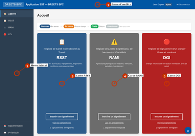

# Application SST — DREETS Bourgogne-Franche-Comté

Plateforme des Registres en Santé et Sécurité au Travail

<p align="center">
  
</p>

## Stack Technique

- **Langage** : PHP 8.5 (vanilla, aucun framework)
- **Base de données** : SQLite via PDO
- **Authentification** : IIS Windows Authentication (pas de LDAP — lecture de `$_SERVER['AUTH_USER']`)
- **Dépendances PHP** : FPDF 1.9 (génération PDF, inclus sans Composer), Parsedown (inclus sans Composer)
- **JavaScript** : AUCUN — zéro JS, tout fonctionne en PHP/HTML/CSS pur
- **Serveur de prod** : IIS 10+ avec FastCGI

## Installation sur IIS

1. Cloner le dépôt dans `C:\inetpub\sst\`
2. Configurer un site IIS pointant vers `C:\inetpub\sst\public\`
3. Activer Windows Authentication (désactiver Anonymous Authentication)
4. Installer PHP 8.3 NTS + extensions (`sqlite3`, `pdo_sqlite`, `mbstring`)
5. Donner les permissions IIS_IUSRS en écriture sur `data\`
7. L'application détecte automatiquement l'environnement (IIS = prod, sinon dev) — voir `DEPLOY.md` pour forcer le mode
8. Accéder à l'application — la base se crée automatiquement

**Voir `DEPLOY.md` pour le guide de déploiement complet.**

## Mise à jour

Sur le serveur, exécuter en tant qu'administrateur :

```cmd
powershell -ExecutionPolicy Bypass -File C:\inetpub\sst\update_sst.ps1
```

Le script effectue : `git pull` → vérification permissions → gate qualité (lint PHP + PHPStan + PHPUnit + CSS checker) → `composer dump-autoload`

## Comptes de test (DEV_MODE)

| Identifiant | Rôle | Site |
|------------|------|------|
| admin.dev | Superviseur | UR21 Côte-d'Or |
| agent.dev | Agent | À choisir au login |
| chsct.dev | Membre CSA/CHSCT | UR25 Doubs |

Mot de passe pour tous : `test`

## Développement local

```bash
php -S localhost:8080 -t public/ public/router.php
# Ouvrir http://localhost:8080/?page=login
```

## Tests

```bash
# Suite de tests unitaires PHPUnit (PHAR via scoop)
phpunit --no-coverage

# Test spécifique PHPUnit
phpunit --filter HelpersTest
phpunit --filter SiteQueriesTest

# Suite de tests E2E Playwright (16 specs, Firefox)
npx playwright test

# Test E2E spécifique
npx playwright test e2e/impersonate.spec.js
npx playwright test --headed           # avec navigateur visible
npx playwright test --ui               # interface interactive

# Anonymisation (dry-run)
php tools/anonymize_old_reports.php --dry-run
```

### Qualité du code

```bash
# PHPStan (level 8, baseline)
phpstan analyse --memory-limit=1G

# GrumPHP (tous les outils d'un coup)
tools/grumphp.phar run

# Rector (auto-migration)
rector process --dry-run

# Deptrac (architecture layers)
deptrac analyse
```

### Couverture de tests

| Suite | Tests | Fichiers | Portée |
|-------|-------|----------|--------|
| **PHPUnit** | 896 (1874 assertions) | 25+ | Unitaires : helpers, queries, validation, accès, crypto, audit, config, formatting, services, repositories |
| **Playwright E2E** | ~208 cas (16 specs) | 16 | Navigation, auth, formulaires, rôles, incarnation, onboarding, version, export, settings, agent_confirm |

## Visibilité des signalements — 3 modes (configurable par le superviseur)

| Mode | Description |
|------|-------------|
| **Confidentiel** | L'agent ne voit que ses propres signalements. Les autres agents ne voient rien. |
| **Choix de l'agent** | L'agent choisit par signalement (public/confidentiel). Confidentiel par défaut. |
| **Visibilité publique** | Tous les signalements du site sont visibles par tous les agents du site. |

Les superviseurs et membres du CSA/CHSCT voient tous les signalements, y compris confidentiels, quel que soit le mode.

## Structure

```
C:\inetpub\sst\
├── public/          ← Racine web (point d'entrée IIS)
│   ├── index.php    ← Routeur principal
│   ├── web.config   ← Configuration IIS
│   ├── css/         ← Feuilles de style
│   └── screenshots/ ← PNG annotés (aide en ligne)
├── src/             ← Logique métier
│   ├── config.php   ← Configuration (APP_ENV, modes visibilité)
│   ├── database.php ← Connexion SQLite + auto-migration
│   ├── autoload.php ← Autoloader PSR-4 + chargeurs procéduraux
│   ├── auth.php     ← Authentification (AUTH_USER / mock login)
│   ├── helpers.php  ← Chargeur → src/helpers/*.php
│   ├── helpers/     ← Modules utilitaires (access, formatting, http, config, crypto, assets)
│   ├── Enum/        ← Enums PHP 8.1+ (ReportState, ReportType, UserRole, VisibilityMode)
│   ├── Repository/  ← Couche d'accès données (Report, User, Site, Stats, Notification)
│   ├── Services/    ← Services métier (Auth, Report, User, Config, Formatting, Crypto, Http, Asset, Session, Notification)
│   ├── DTO/         ← Data Transfer Objects (CreateReport, UpdateReport, ReportFilter, etc.)
│   ├── Router/      ← Routeur interne + templates
│   ├── queries/     ← Fonctions procédurales (wrappers vers Repository)
│   ├── middleware/   ← Contrôle d'accès + bootstrap
│   ├── mail/        ← Templates email + renderer
│   ├── mail.php     ← Envoi SMTP
│   ├── cron.php     ← Lazy cron (check_delays + anonymize)
│   ├── audit.php    ← Journal d'audit
│   └── lib/         ← Parsedown.php, fpdf/
├── pages/           ← Pages de l'application
├── handlers/        ← Traitements des formulaires POST
├── templates/       ← Templates réutilisables (header, sidebar, footer, user_form_fields...)
├── tests/           ← Tests unitaires PHPUnit (860 tests, 1804 assertions)
├── e2e/             ← Tests E2E Playwright (15 specs, ~207 cas)
├── tools/           ← Scripts CLI (capture_screenshots.py, check_delays, anonymize...)
├── docs/            ← Documentation et captures HTML source
├── data/            ← Base SQLite (auto-créée, git-ignorée)
├── schema.sql       ← Schéma de la base
├── CHANGELOG.md     ← Historique des versions (source de vérité)
├── phpunit.xml      ← Configuration PHPUnit
├── update_sst.ps1   ← Script de mise à jour automatisée
├── DEPLOY.md        ← Guide de déploiement IIS complet
├── SPEC.md          ← Spécification technique détaillée
└── README.md        ← Ce fichier
```

## Sécurité

- Requêtes SQL préparées (PDO) — Protection injection SQL
- `htmlspecialchars` via `e()` — Protection XSS
- Tokens CSRF sur tous les formulaires
- Contrôle d'accès par rôle (`requireRole`)
- Vérification d'appartenance (auteur seul peut modifier/abandonner)
- Visibilité par site + 3 modes de confidentialité
- Session sécurisée (HttpOnly, SameSite, Secure en prod)
- Échappement CSV (protection injection formule Excel)
- Validation côté serveur de tous les inputs
- Zéro JavaScript — pas de surface d'attaque XSS côté client

## 3 Registres

| Registre | Sigle | Couleur | Usage |
|----------|-------|---------|-------|
| Santé et Sécurité au Travail | RSST | Bleu | Signalements généraux |
| Agressions, Menaces et Incivilités | RAMI | Gris | Agressions verbales/physiques |
| Danger Grave et Imminent | DGI | Rouge | Dangers immédiats |

## 3 Rôles

| Rôle | Permissions |
|------|------------|
| Agent | Créer, voir (selon mode de visibilité), modifier (ses signalements) |
| Superviseur | Agent + Répondre, Abandonner, Synthèse, Export, Stats, Paramètres, Utilisateurs, Impression |
| CSA/CHSCT | Vue élargie sur tous les sites (lecture), Synthèse, Export, Stats |
