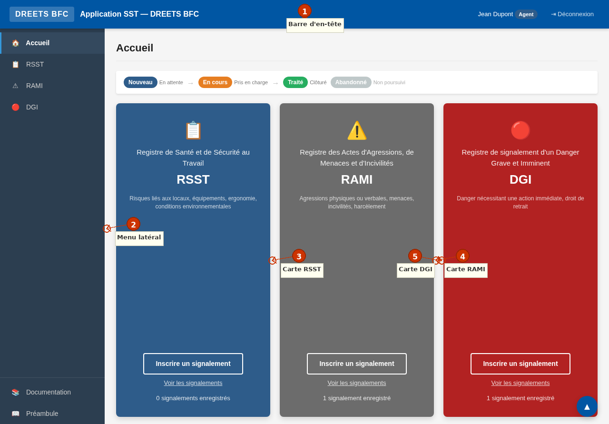
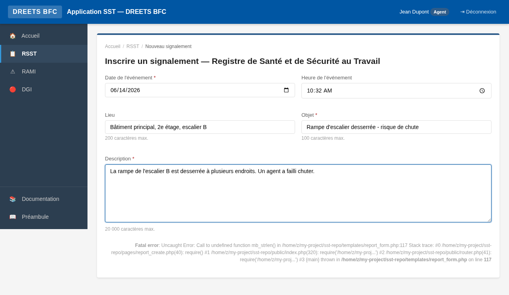
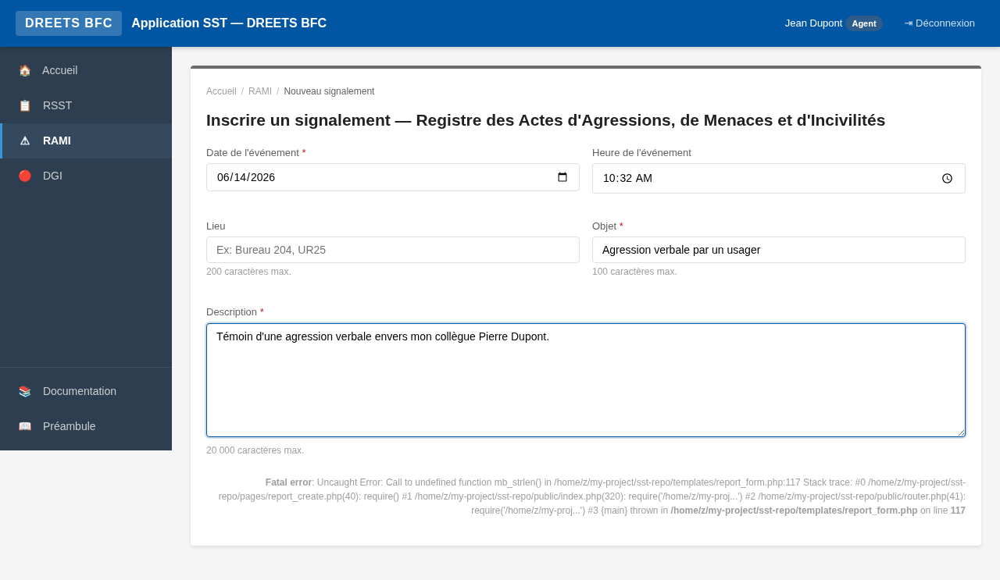
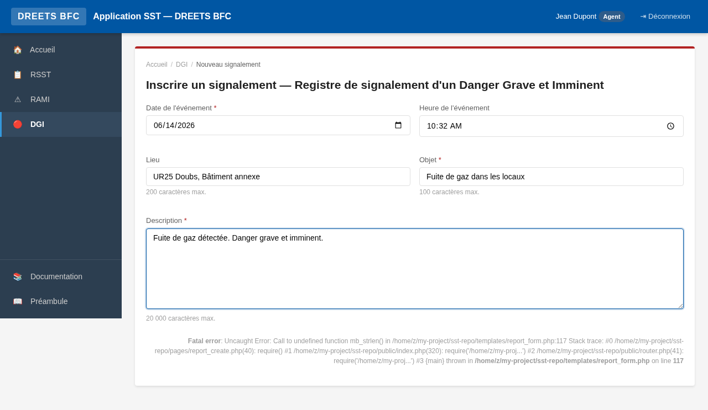

# Manuel de l'Agent — Application SST DREETS BFC

> **Plateforme des Registres en Santé et Sécurité au Travail**
> DREETS Bourgogne-Franche-Comté

---

## Introduction

Bienvenue dans le manuel de l'utilisateur **Agent** de l'Application SST. Ce guide vous accompagne pas à pas dans l'utilisation de l'application pour signaler des événements liés à la santé, la sécurité et l'intégrité au travail, et pour suivre le traitement de vos signalements.

L'Application SST est un outil de signalement en ligne mis à disposition par la DREETS Bourgogne-Franche-Comté. Elle permet à chaque agent de consigner des événements relevant de trois registres distincts, conformément aux dispositions du Code du travail et du Code général de la fonction publique. L'application est accessible depuis votre navigateur web (Mozilla Firefox ou Google Chrome recommandés) et ne nécessite aucune installation sur votre poste de travail.

En tant qu'agent, vous êtes le premier maillon du dispositif de signalement. Votre rôle est essentiel : en signalant les situations à risque, vous contribuez activement à l'amélioration des conditions de santé et de sécurité pour l'ensemble des agents de votre unité. Ce manuel détaille toutes les opérations que vous pouvez réaliser : vous connecter, créer un signalement dans le registre approprié, suivre l'avancement de vos signalements, modifier un signalement non encore traité, et comprendre les règles de confidentialité qui protègent vos données.

> **Important :** Aucune sanction ne peut être prise à votre encontre pour avoir signalé une situation de danger. Le signalement est un droit et une contribution à la sécurité collective.

---

## 1. Première connexion

### Authentification

En production, l'application utilise l'**authentification Windows intégrée** (IIS). Vous n'avez pas de formulaire de connexion à remplir : l'application identifie automatiquement votre compte à partir de votre session Windows. Il vous suffit d'ouvrir l'adresse de l'application dans votre navigateur pour être connecté.

En mode développement (environnement de test), un écran de connexion vous permet de saisir un identifiant. Les comptes de test disponibles sont :

| Identifiant | Profil | Site |
|---|---|---|
| `admin.dev` | Superviseur | UR21 — Côte-d'Or |
| `agent.dev` | Agent | Choix du site à la première connexion |
| `chsct.dev` | Membre CSA/CHSCT | UR25 — Doubs |

Le mot de passe en mode développement est `test` (il n'est pas vérifié).

### Choix du site — étape obligatoire et définitive

Lors de votre toute première connexion, l'application vous demande de **sélectionner votre site** (unité régionale). Cette étape est obligatoire et s'affiche automatiquement si aucun site n'est encore associé à votre compte.

1. L'écran affiche le message : **« Bienvenue, [Votre Prénom] [Votre Nom] »**.
2. Un menu déroulant liste les sites actifs (par exemple : `UR21 — UR Côte-d'Or`, `UR25 — UR Doubs`).
3. Sélectionnez le site auquel vous êtes rattaché.
4. Cliquez sur **« Confirmer mon choix »**.

> ⚠️ **Attention : ce choix est définitif.** Vous ne pourrez pas modifier votre site vous-même par la suite. En cas d'erreur ou de changement d'affectation, vous devrez contacter un superviseur qui seul peut modifier votre rattachement à un site via la gestion des utilisateurs.

Une fois votre site confirmé, vous êtes redirigé vers la page d'accueil de l'application. Vous n'aurez plus à effectuer cette étape lors de vos prochaines connexions.

---

## 2. Accueil

La page d'accueil est votre tableau de bord principal. Elle présente les **trois registres de signalement** sous forme de cartes, chacune avec un code couleur distinct, un bouton de création et un lien vers la liste des signalements existants.

### Les trois cartes de registre

| Carte | Couleur | Description |
|---|---|---|
| 📋 **RSST** — Registre de Santé et de Sécurité au Travail | Bleu | Risques liés aux locaux, équipements, ergonomie, conditions environnementales |
| ⚠️ **RAMI** — Registre des Actes d'Agressions, de Menaces et d'Incivilités | Gris | Agressions physiques ou verbales, menaces, incivilités, harcèlement |
| 🔴 **DGI** — Registre de signalement d'un Danger Grave et Imminent | Rouge | Danger nécessitant une action immédiate, droit de retrait |

Chaque carte affiche :
- Un **bouton « Inscrire un signalement »** pour créer un nouveau signalement dans ce registre.
- Un **lien « Voir les signalements »** pour accéder à la liste des signalements existants.
- Le **nombre de signalements enregistrés** que vous êtes autorisé à voir (selon le mode de visibilité configuré).

### Légende des états

Si des signalements existent déjà, une barre de légende apparaît en haut de la page pour vous rappeler le cycle de vie d'un signalement :

- **Nouveau** → En attente de traitement par un superviseur
- **En cours** → Pris en charge par un superviseur
- **Traité** → Signalement clôturé avec réponse
- **Abandonné** → Signalement non poursuivi

### Bannière de bienvenue

Si aucun signalement n'a encore été créé, une bannière de bienvenue s'affiche avec un message d'accompagnement : elle vous invite à choisir le registre correspondant à votre situation et à cliquer sur « Inscrire un signalement ». Un lien vers la documentation est également proposé pour vous guider dans vos premiers pas.

---

## 3. Créer un signalement

Pour créer un signalement, cliquez sur le bouton **« Inscrire un signalement »** de la carte correspondant au registre souhaité (RSST, RAMI ou DGI). Vous accédez alors au formulaire de création, adapté au type de registre sélectionné.

### 3.1 Champs communs à tous les registres

Quel que soit le registre, le formulaire contient les champs suivants :

| Champ | Obligatoire | Détails |
|---|---|---|
| **Date de l'événement** | ✅ Oui | Date à laquelle l'événement s'est produit. La date ne peut pas être dans le futur. Par défaut, la date du jour est pré-remplie. |
| **Heure de l'événement** | Non | Heure de l'événement au format HH:MM. Par défaut, l'heure actuelle est pré-remplie. |
| **Lieu** | Non | Lieu où l'événement s'est produit (200 caractères max). Exemple : *Bureau 204, UR25* ou *Accueil public, site de Besançon*. |
| **Objet** | ✅ Oui | Résumé du signalement en 100 caractères maximum. C'est le titre qui apparaîtra dans la liste. Exemple : *Fuite d'eau plafond bureau 204* ou *Agression verbale par un usager*. |
| **Description** | ✅ Oui | Description détaillée du signalement (20 000 caractères max). Décrivez les faits avec précision : circonstances, personnes impliquées, conséquences observées, actions déjà engagées. Un compteur de caractères vous indique en temps réel le nombre saisi. |
| **Pièce jointe** | Non | Vous pouvez joindre un fichier image (JPG, PNG, GIF) ou un document PDF. Taille maximale : 10 Mo. Ce champ est utile pour documenter visuellement une situation (photo d'un équipement défectueux, capture d'écran d'un message menaçant, etc.). |
| **Site (UR)** | Automatique | Votre site d'affectation est automatiquement sélectionné. Vous ne pouvez pas créer de signalement pour un autre site. |
| **Déclarant** | Automatique | Votre nom et prénom sont affichés en lecture seule. Ils sont automatiquement associés au signalement. |

### 3.2 Confidentialité (selon le mode configuré)

Selon le paramétrage défini par le superviseur, le formulaire peut afficher un champ de confidentialité. Trois cas sont possibles :

- **Mode « Confidentiel »** : un bandeau 🔒 **Confidentiel** vous informe que votre signalement ne sera visible que par vous, les superviseurs et les membres du CSA/CHSCT. Aucune action de votre part n'est nécessaire.
- **Mode « Choix de l'agent »** : une case à cocher **« Signalement confidentiel »** apparaît, cochée par défaut. Si vous la décochez, un avertissement s'affiche pour vous rappeler que le signalement sera visible par tous les agents de votre site.
- **Mode « Visibilité publique »** : aucune option de confidentialité n'est affichée. Tous les signalements seront visibles par tous les agents du site.

Pour en savoir plus, consultez la section [Comprendre la confidentialité](#7-comprendre-la-confidentialité).

### 3.3 Champs spécifiques au registre RSST

Le formulaire RSST ne comporte pas de champs supplémentaires au-delà des champs communs. Il est adapté au signalement de situations générales de santé et sécurité au travail : problèmes de locaux, d'équipements, d'ergonomie, de conditions environnementales (bruit, éclairage, température, qualité de l'air).

**Exemple de signalement RSST :**
- *Objet* : Porte coupe-feu bloquée en position ouverte
- *Description* : Depuis le 15/01/2025, la porte coupe-feu du 2e étage du bâtiment A (à côté du bureau 204) est bloquée en position ouverte par un caisson. Ce dysfonctionnement compromet la sécurité incendie de l'étage entier. Le problème a été signalé oralement au responsable logistique le 16/01 mais aucune action n'a été entreprise à ce jour.
- *Lieu* : Bâtiment A, 2e étage, UR21 Dijon

### 3.4 Champs spécifiques au registre RAMI

Le registre RAMI comporte des champs supplémentaires spécifiques au signalement d'agressions, menaces et incivilités :

#### « Signaler pour le compte d'un autre agent »

Une case à cocher **« Signaler pour le compte d'un autre agent »** permet à un agent de déclarer un événement dont il a été témoin et qui a affecté un collègue. Cette option est particulièrement utile lorsqu'un agent victime ne souhaite pas ou ne peut pas effectuer lui-même le signalement.

Lorsque vous cochez cette case, deux champs supplémentaires apparaissent :
- **Nom de l'agent** : nom de famille de la personne concernée (obligatoire si la case est cochée).
- **Prénom de l'agent** : prénom de la personne concernée (obligatoire si la case est cochée).

**Exemple** : Vous assistez à une agression verbale d'un usager envers votre collègue Marie Dupont. Vous cochez « Signaler pour le compte d'un autre agent » et renseignez ses nom et prénom. Vous êtes le déclarant, mais le signalement indique qu'il est déposé pour le compte de Marie Dupont.

#### Nature de l'auteur

Ce champ optionnel permet de catégoriser l'auteur des faits :
- **Usager** : personne externe accueillie ou rencontrée dans le cadre du service
- **Collègue** : autre agent de la structure
- **Hiérarchie** : supérieur hiérarchique
- **Tiers** : toute autre personne externe (prestataire, livreur, intervenant extérieur)

Ce renseignement est utile pour les statistiques du CSA/CHSCT et permet d'orienter les actions de prévention.

#### Type d'acte

Ce champ optionnel permet de qualifier la nature de l'acte :
- **Verbal** : insultes, cris, propos injurieux, menaces verbales
- **Physique** : coups, bousculades, crachats, agression physique
- **Moral** : harcèlement moral, dénigrement, mise à l'écart, brimades
- **Sexiste** : agissements sexistes, propos ou comportements dégradants fondés sur le sexe
- **Autre** : tout acte ne rentrant pas dans les catégories ci-dessus

**Exemple de signalement RAMI :**
- *Objet* : Agression verbale d'un usager à l'accueil
- *Description* : Ce matin à 9h15, un usager mécontent s'est présenté à l'accueil de la UR25 et a insulté gravement l'agent d'accueil, proférant des menaces de mort. L'agent a été pris de panique et a dû quitter son poste. La sécurité a été appelée et l'usager a été exclu des locaux.
- *Nature de l'auteur* : Usager
- *Type d'acte* : Verbal
- *Pour le compte de* : (si vous signalez pour votre collègue) Dupont, Marie

### 3.5 Champs spécifiques au registre DGI

Le registre DGI ne comporte pas de champs supplémentaires au-delà des champs communs, mais il est destiné aux situations de **danger grave et imminent**, c'est-à-dire une menace pouvant entraîner un accident du travail grave ou une maladie professionnelle grave dans l'immédiat.

Les signalements DGI font l'objet d'une **procédure d'urgence** : ils sont traités en priorité par les superviseurs. Le formulaire DGI vaut **notification au sens de l'article L4131-1 du Code du travail** (droit de retrait individuel de l'agent).

**Exemple de signalement DGI :**
- *Objet* : Fuite de gaz dans le sous-sol du bâtiment B
- *Description* : Une forte odeur de gaz est détectée dans le sous-sol du bâtiment B depuis 14h30. Le local technique est inaccessible en raison de l'odeur. Plusieurs agents ont signalé des maux de tête. Le gaz n'a pas été coupé. Le bâtiment est toujours occupé par une vingtaine d'agents.
- *Lieu* : Bâtiment B, sous-sol, local technique, UR25 Besançon

> ⚠️ **En cas de danger grave et imminent, n'attendez pas :** signalez immédiatement la situation via ce registre et exercez votre droit de retrait si nécessaire. Prévenez également oralement votre hiérarchie et les services d'urgence si la situation le justifie.

### 3.6 Validation du signalement

Une fois le formulaire rempli, cliquez sur le bouton **« Valider son signalement »**. L'application vérifie les informations saisies :

- Si des erreurs sont détectées (champs obligatoires manquants, date dans le futur, fichier trop volumineux, format incorrect), vous êtes redirigé vers le formulaire avec des messages d'erreur en rouge sous chaque champ concerné. Les données déjà saisies sont conservées pour que vous n'ayez pas à les ressaisir.
- Si tout est correct, le signalement est enregistré avec un **numéro de référence** automatique au format `{type}-{AA}-{NNN}` (par exemple : `rsst-25-001`, `rami-25-003`, `dgi-25-002`).

Vous êtes alors redirigé vers la page de détail de votre signalement, qui affiche la référence, l'état **« Nouveau »** et toutes les informations saisies. Un message de confirmation vert s'affiche en haut de la page : *« Signalement enregistré avec la référence rsst-25-001 »*.

Un e-mail de notification est automatiquement envoyé aux superviseurs de votre site pour les informer du nouveau signalement (si le serveur de messagerie est configuré).

---

## 4. Suivre ses signalements

Après avoir créé un ou plusieurs signalements, vous pouvez suivre leur état d'avancement depuis la page de liste de chaque registre.

### Accéder à la liste des signalements

Depuis la page d'accueil, cliquez sur le lien **« Voir les signalements »** de la carte du registre souhaité (RSST, RAMI ou DGI). Vous accédez à la liste paginée de tous les signalements que vous êtes autorisé à voir.

### Contenu du tableau

Le tableau affiche les colonnes suivantes pour chaque signalement :

| Colonne | Description |
|---|---|
| **Référence** | Identifiant unique du signalement (ex. : `rami-25-003`) |
| **Date** | Date de l'événement au format JJ/MM/AAAA |
| **Objet** | Résumé du signalement (tronqué si trop long) |
| **Nom** | Nom du déclarant |
| **Prénom** | Prénom du déclarant |
| **UR** | Code du site (ex. : `UR21`) |
| **État** | Badge coloré : Nouveau (bleu), En cours (orange), Traité (vert), Abandonné (gris) |
| **Visibilité** | 🔒 Confidentiel ou Public |
| **Actions** | Boutons Voir, Modifier (si autorisé) |

### Filtrer les signalements

Une barre de filtres en haut de la page vous permet de rechercher et de filtrer les signalements :

- **État** : filtrez par état (Nouveau, En cours, Traité, Abandonné) ou affichez tous les états.
- **Recherche** : saisissez un mot-clé pour rechercher dans l'objet ou la description des signalements. Par exemple, tapez « fuite » pour retrouver tous les signalements mentionnant une fuite.
- Cliquez sur **« Filtrer »** pour appliquer les critères.

Les filtres sont cumulatifs : vous pouvez combiner un filtre d'état et une recherche textuelle. Les paramètres de filtrage sont conservés dans l'URL, ce qui vous permet de partager un lien vers une vue filtrée.

### Pagination

La liste affiche 20 signalements par page. Si le nombre de signalements dépasse cette limite, une barre de pagination apparaît en bas de la page pour naviguer entre les pages.

### Consulter le détail d'un signalement

Cliquez sur le bouton **« Voir »** d'un signalement pour accéder à sa page de détail. Cette page affiche toutes les informations du signalement : référence, date, heure, lieu, objet, description, déclarant, site, pièces jointes, ainsi que l'historique des réponses du superviseur.

Si des réponses ont été apportées par un superviseur, elles sont présentées dans un tableau avec la date, le nom du répondant, le nouvel état éventuel et le texte de la réponse.

### Ce que vous voyez selon le mode de visibilité

Le contenu de la liste dépend du mode de visibilité configuré par le superviseur :

- **Mode Confidentiel** : vous ne voyez que **vos propres signalements**. Les signalements des autres agents ne vous sont pas accessibles.
- **Mode Choix de l'agent** : vous voyez vos propres signalements + les signalements **publics** des autres agents de votre site. Les signalements confidentiels des autres agents ne vous sont pas accessibles.
- **Mode Visibilité publique** : vous voyez **tous les signalements** de votre site, y compris ceux déposés par d'autres agents.

Dans tous les cas, les superviseurs et les membres du CSA/CHSCT ont accès à l'ensemble des signalements de leur site (et de tous les sites pour les superviseurs).

---

## 5. Modifier un signalement

Vous pouvez modifier un signalement que vous avez créé, mais uniquement sous certaines conditions.

### Conditions de modification

- Vous devez être le **déclarant** du signalement (seul l'auteur peut modifier son signalement).
- Le signalement doit être à l'état **« Nouveau »** ou **« En cours »**. Un signalement à l'état « Traité » ou « Abandonné » ne peut plus être modifié.

### Comment modifier

1. Depuis la liste des signalements, repérez votre signalement. Le bouton **« Modifier »** apparaît dans la colonne Actions si la modification est autorisée.
2. Vous pouvez également accéder au détail du signalement (bouton « Voir ») puis cliquer sur **« Modifier »** en bas de la page.
3. Le formulaire de modification s'affiche, pré-rempli avec les données existantes. Il est identique au formulaire de création, à l'exception du champ de site qui n'est pas modifiable.
4. Modifiez les champs souhaités : vous pouvez corriger la date, l'heure, le lieu, l'objet, la description, ou ajouter/remplacer/supprimer une pièce jointe.
5. Cliquez sur **« Enregistrer »** pour valider vos modifications.

### Pièce jointe en mode modification

Si le signalement comporte déjà une pièce jointe, elle est affichée avec son nom de fichier. Vous avez la possibilité de **supprimer la pièce jointe actuelle** en cochant la case « Supprimer la pièce jointe actuelle », ou de la remplacer en sélectionnant un nouveau fichier via le champ de téléchargement.

### Limites

- Vous ne pouvez pas modifier le **type de registre** (RSST, RAMI, DGI) : si vous avez déposé un signalement dans le mauvais registre, vous devez l'abandonner et en créer un nouveau dans le registre approprié.
- Vous ne pouvez pas modifier le **site** rattaché au signalement.
- La **visibilité** (confidentiel/public) n'est pas modifiable après la création du signalement en mode « Choix de l'agent ». En mode « Confidentiel » ou « Public », ce paramètre est figé par la configuration.
- Une fois le signalement passé à l'état **« Traité »**, toute modification est impossible. Si vous constatez une erreur après traitement, contactez le superviseur qui a traité le signalement.

---

## 6. Abandonner un signalement

Si vous souhaitez retirer un signalement que vous avez créé (parce que le problème est résolu, ou parce que vous l'avez déposé par erreur), vous pouvez l'**abandonner**.

### Conditions d'abandon

- Vous devez être le **déclarant** du signalement.
- Le signalement ne doit pas être à l'état **« Traité »** ni **« Abandonné »**. Vous pouvez abandonner un signalement à l'état « Nouveau » ou « En cours ».

### Comment abandonner

1. Accédez au détail du signalement (bouton « Voir »).
2. En bas de la page, cliquez sur le bouton **« Abandonner le signalement »**.
3. Un message de confirmation apparaît : **« ⚠ Abandonner ce signalement ? »**.
4. Cliquez sur **« Oui, abandonner »** pour confirmer, ou **« Annuler »** pour revenir en arrière.

L'état du signalement passe alors à **« Abandonné »**. Cette action est irréversible : un signalement abandonné ne peut pas être rouvert. Il reste toutefois consultable dans la liste (en filtrant par l'état « Abandonné ») pour des raisons de traçabilité.

---

## 7. Comprendre la confidentialité

La confidentialité est un aspect fondamental de l'Application SST. Elle garantit que vos signalements sont protégés et que seules les personnes habilitées peuvent y accéder. Le mode de visibilité est configuré par le superviseur et peut varier d'un registre à l'autre.

### Les trois modes de visibilité

#### 🔒 Mode Confidentiel

Dans ce mode, **vous êtes le seul agent à voir vos signalements**. Aucun autre agent de votre site ne peut consulter vos signalements, même s'ils sont dans le même registre. En revanche, les **superviseurs** et les **membres du CSA/CHSCT** ont accès à tous les signalements confidentiels, car leur rôle nécessite de pouvoir traiter chaque signalement déposé.

> Ce mode est le plus protecteur pour l'agent. Il est particulièrement adapté au registre RAMI, où les signalements d'agressions ou de harcèlement peuvent contenir des informations sensibles que l'agent ne souhaite pas partager avec l'ensemble de ses collègues.

**Ce que vous voyez :** uniquement vos propres signalements.
**Ce que les autres agents voient :** uniquement leurs propres signalements.

#### 🤝 Mode « Choix de l'agent »

Dans ce mode, **vous choisissez au moment de la création** si votre signalement sera confidentiel ou public. Par défaut, la case « Signalement confidentiel » est cochée, ce qui signifie que vos signalements sont confidentiels sauf si vous décidez explicitement de les rendre publics.

Si vous **décochez** la case, un avertissement s'affiche : *« ⚠ Attention : ce signalement sera visible par tous les agents de votre UR, y compris son objet et sa description. »* Cette mise en garde vous permet de prendre une décision éclairée.

**Ce que vous voyez :** vos propres signalements + les signalements publics des autres agents de votre site.
**Ce que les autres agents voient :** leurs propres signalements + vos signalements publics (si vous en avez créé).

> **Conseil pratique :** gardez le mode confidentiel par défaut pour les signalements impliquant des situations délicates (RAMI, DGI). Ne rendez un signalement public que si vous estimez que l'information peut utilement être partagée avec vos collègues (par exemple, un problème d'infrastructure que tout le monde peut constater).

#### 👁 Mode Visibilité publique

Dans ce mode, **tous les signalements du site sont visibles par tous les agents du site**, quel que soit leur auteur. Aucune option de confidentialité n'est proposée lors de la création. Ce mode correspond à l'esprit du décret 82-453 article 3-2, qui dispose que le registre RSST est tenu à la disposition de l'ensemble des agents pour consultation.

> Ce mode est le plus transparent. Il est conforme à la vocation consultative du registre RSST, mais peut ne pas être approprié pour les registres RAMI et DGI si les signalements contiennent des informations personnelles sensibles.

**Ce que vous voyez :** tous les signalements de votre site, qu'ils soient de votre fait ou d'autres agents.
**Ce que les autres agents voient :** tous les signalements de votre site, y compris les vôtres.

### Visibilité par registre

Le superviseur peut configurer un mode de visibilité différent pour chaque registre. Par exemple :
- **RSST** : visibilité publique (conforme au décret 82-453, le registre étant consultable par tout agent)
- **RAMI** : choix de l'agent (pour protéger la confidentialité des signalements d'agressions)
- **DGI** : confidentiel (pour protéger les signalements de dangers graves impliquant des situations sensibles)

Si un mode spécifique n'est pas configuré pour un registre, c'est le mode global qui s'applique.

### Traçabilité des accès

Chaque fois qu'un superviseur ou un membre du CSA/CHSCT consulte un signalement confidentiel qu'il n'a pas lui-même déposé, cet accès est **enregistré dans un journal d'audit**. Cela garantit que les consultations de signalements confidentiels sont traçables et que l'agent dépositaire peut être assuré que ses signalements ne sont consultés que dans le cadre du traitement légitime.

### Résumé des droits d'accès

| Rôle | Voir ses signalements | Voir les signalements des autres agents | Voir tous les sites |
|---|---|---|---|
| **Agent** (mode Confidentiel) | ✅ Oui | ❌ Non | ❌ Non |
| **Agent** (mode Choix de l'agent) | ✅ Oui | ✅ Uniquement les publics | ❌ Non |
| **Agent** (mode Visibilité publique) | ✅ Oui | ✅ Oui (même site) | ❌ Non |
| **Superviseur** | ✅ Oui | ✅ Oui (tous) | ✅ Oui |
| **Membre CSA/CHSCT** | ✅ Oui | ✅ Oui (tous) | ✅ Oui |

---

## 8. Questions fréquentes

### Connexion et compte

**Q : Comment me connecter à l'application ?**
R : En production, la connexion est automatique grâce à l'authentification Windows intégrée. Ouvrez simplement l'adresse de l'application dans votre navigateur (Firefox ou Chrome recommandé). En mode test, un formulaire de connexion vous permet de saisir votre identifiant.

**Q : Je me suis trompé dans le choix de mon site lors de ma première connexion. Que faire ?**
R : Le choix du site est définitif et ne peut pas être modifié par l'agent. Contactez un superviseur de votre site pour qu'il modifie votre rattachement via la gestion des utilisateurs. Le superviseur peut réaffecter votre compte au bon site en quelques clics.

**Q : Mon nom ou prénom est incorrect dans l'application. Comment le corriger ?**
R : Votre nom et prénom sont synchronisés depuis votre compte Windows lors de votre première connexion. S'ils sont incorrects, contactez un superviseur qui peut modifier ces informations depuis la fiche utilisateur.

### Création de signalement

**Q : Dans quel registre dois-je créer mon signalement ?**
R : Choisissez le registre en fonction de la nature de l'événement :
- **RSST** : pour les problèmes de locaux, d'équipements, d'ergonomie, de conditions environnementales (bruit, température, qualité de l'air, etc.).
- **RAMI** : pour les agressions, menaces, incivilités, harcèlement moral ou sexuel, agissements sexistes. Si vous êtes témoin d'une agression envers un collègue, utilisez l'option « Signaler pour le compte d'un autre agent ».
- **DGI** : pour les situations de danger grave et imminent nécessitant une action immédiate (fuite de gaz, risque d'effondrement, exposition immédiate à un danger mortel).

**Q : Puis-je créer un signalement pour un événement qui s'est produit il y a longtemps ?**
R : Oui. La date de l'événement peut être antérieure à la date du jour. En revanche, vous ne pouvez pas saisir une date dans le futur. Décrivez l'événement avec le plus de précision possible, même s'il est ancien.

**Q : La pièce jointe est-elle obligatoire ?**
R : Non, la pièce jointe est optionnelle. Elle est cependant recommandée lorsqu'elle permet de documenter visuellement la situation (photo d'un équipement défectueux, capture d'écran d'un message, etc.). Les formats acceptés sont JPG, PNG, GIF et PDF, dans la limite de 10 Mo.

**Q : Que signifie « Signaler pour le compte d'un autre agent » (RAMI) ?**
R : Cette option vous permet de signaler un événement dont a été victime un collègue, avec son accord. Vous êtes le déclarant (celui qui remplit le formulaire), mais le signalement indique le nom et le prénom de la personne concernée. Cette faculté est prévue par la réglementation RAMI pour permettre aux témoins d'agressions de signaler les faits lorsque la victime ne souhaite pas ou ne peut pas le faire elle-même.

**Q : Que se passe-t-il après la création de mon signalement ?**
R : Votre signalement reçoit automatiquement un numéro de référence unique (ex. : `rami-25-003`) et passe à l'état **« Nouveau »**. Les superviseurs de votre site sont notifiés par e-mail (si la messagerie est configurée). Un superviseur prendra ensuite en charge votre signalement en le passant à l'état **« En cours »**, puis en le traitant avec une réponse écrite (état **« Traité »**). Vous pouvez suivre l'évolution de votre signalement à tout moment depuis la liste.

### Suivi et modification

**Q : Puis-je modifier un signalement après l'avoir créé ?**
R : Oui, tant que le signalement est à l'état **« Nouveau »** ou **« En cours »**. Accédez au détail du signalement et cliquez sur « Modifier ». Une fois le signalement traité ou abandonné, la modification n'est plus possible.

**Q : Puis-je supprimer un signalement ?**
R : Non, la suppression n'est pas possible pour des raisons de traçabilité réglementaire. Vous pouvez en revanche **abandonner** un signalement que vous ne souhaitez plus poursuivre. Le signalement reste consultable mais son état passe à « Abandonné ».

**Q : Comment savoir si un superviseur a répondu à mon signalement ?**
R : Consultez le détail de votre signalement en cliquant sur « Voir ». Si un superviseur a répondu, un tableau « Réponses » apparaît en dessous des informations du signalement, avec la date, le nom du répondant et le texte de la réponse. L'état du signalement passe de « Nouveau » à « En cours » puis à « Traité » au fil du traitement.

**Q : Mon signalement reste à l'état « Nouveau » depuis longtemps. Que faire ?**
R : Si un délai d'alerte a été configuré par le superviseur, un e-mail de rappel est automatiquement envoyé. Vous pouvez également relancer oralement le superviseur de votre site. En cas de danger persistant, n'hésitez pas à créer un nouveau signalement pour rappeler l'urgence de la situation.

### Confidentialité

**Q : Qui peut voir mes signalements confidentiels ?**
R : Seuls les **superviseurs** et les **membres du CSA/CHSCT** peuvent consulter les signalements confidentiels. Chaque consultation d'un signalement confidentiel par un superviseur ou un membre du CSA/CHSCT est enregistrée dans un journal d'audit, garantissant la traçabilité des accès.

**Q : Puis-je changer la visibilité d'un signalement après sa création ?**
R : En mode « Choix de l'agent », la visibilité est définie au moment de la création et ne peut pas être modifiée ultérieurement. Si vous souhaitez changer la visibilité, vous devez abandonner le signalement actuel et en créer un nouveau avec la visibilité souhaitée. En modes « Confidentiel » ou « Public », la visibilité est imposée par la configuration et ne peut pas être changée.

**Q : Un agent d'un autre site peut-il voir mes signalements ?**
R : Non. Les agents ne voient que les signalements de leur propre site, selon le mode de visibilité en vigueur. Les signalements d'un site ne sont jamais visibles par les agents d'un autre site. Seuls les superviseurs et les membres du CSA/CHSCT ont une vue multi-sites.

**Q : Que se passe-t-il si je signale une situation délicate (harcèlement, agression) ?**
R : Votre signalement est traité de manière confidentielle. Les superviseurs sont tenus de traiter chaque signalement avec discernement. Le journal d'audit garantit que seules les personnes habilitées consultent les signalements confidentiels. Si vous vous sentez en danger immédiat, signalez la situation via le registre DGI et contactez les services d'urgence si nécessaire.

### Divers

**Q : L'application fonctionne-t-elle sur mon téléphone portable ?**
R : L'application est optimisée pour une utilisation sur ordinateur (navigateurs Firefox et Chrome). L'affichage s'adapte aux écrans de taille réduite, mais l'expérience optimale est obtenue sur un écran de bureau.

**Q : Puis-je imprimer un signalement ?**
R : Oui. Depuis la page de détail d'un signalement, cliquez sur le bouton **« Voir en PDF »** pour générer une version imprimable au format PDF. Ce document reprend l'ensemble des informations du signalement, y compris les réponses éventuelles.

**Q : Qui contacter en cas de problème technique ?**
R : Contactez le superviseur de votre site en premier lieu. Il peut vérifier la configuration de votre compte et, si nécessaire, escalader le problème vers l'équipe technique responsable de l'application.

---

*DREETS Bourgogne-Franche-Comté — Application SST, version 3.8.3*
