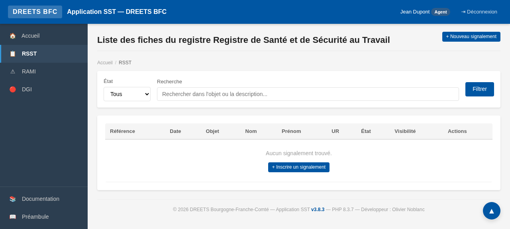
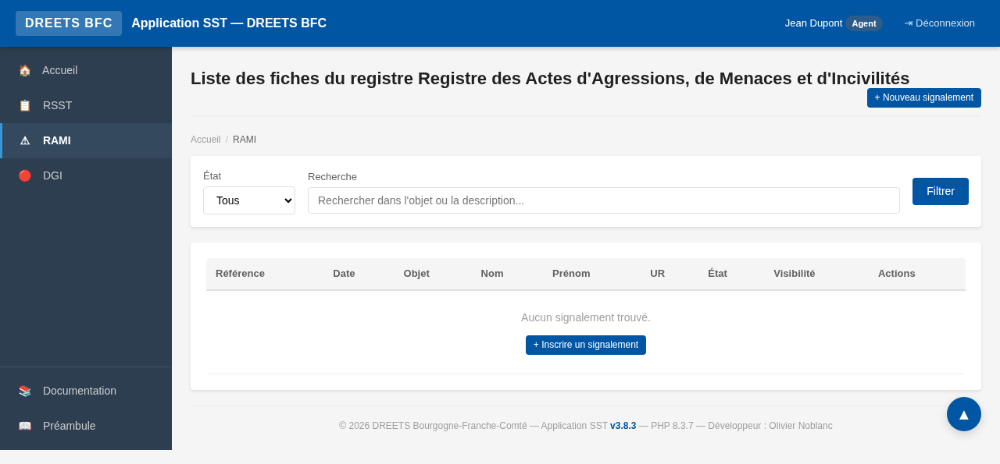
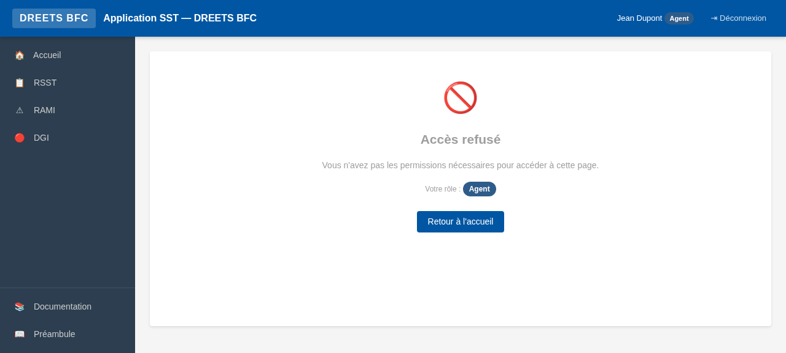
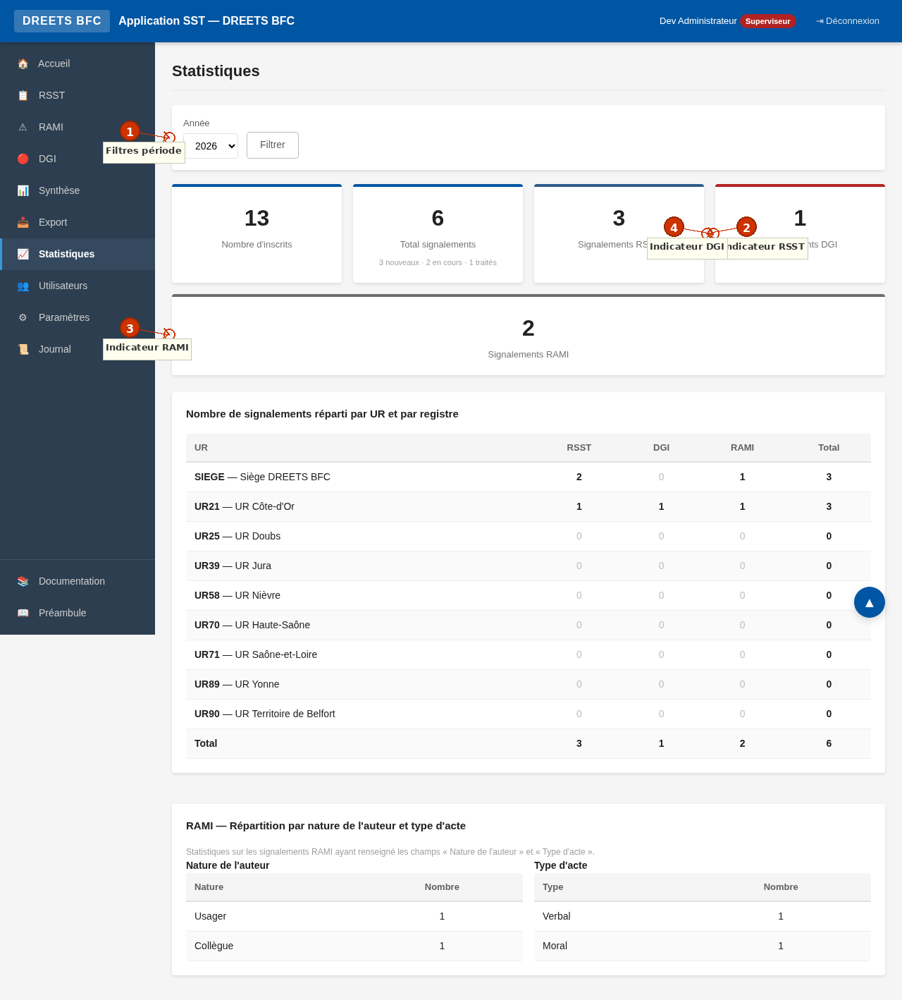

# Manuel du Superviseur — Application SST DREETS BFC

> **Plateforme des Registres en Santé et Sécurité au Travail**
> DREETS Bourgogne-Franche-Comté

---

## Introduction

Bienvenue dans le manuel de l'utilisateur **Superviseur** de l'Application SST. Ce guide complet vous accompagne dans l'ensemble des opérations que vous pouvez réaliser en tant que superviseur, depuis la connexion jusqu'à la configuration avancée de l'application.

L'Application SST est un outil de signalement en ligne mis à disposition par la DREETS Bourgogne-Franche-Comté. Elle permet de consigner et de suivre les événements relevant de trois registres distincts, conformément aux dispositions du Code du travail et du Code général de la fonction publique. En tant que superviseur, vous disposez de privilèges étendus qui vous permettent non seulement de créer des signalements comme tout agent, mais aussi de **traiter les signalements**, de **superviser l'ensemble des sites**, d'**accéder aux outils d'analyse** (synthèse, statistiques, export), de **gérer les utilisateurs** et de **configurer l'application**.

Votre rôle est central dans le dispositif : vous êtes le garant du suivi et du traitement des signalements déposés par les agents. La réactivité et la qualité de vos réponses contribuent directement à l'efficacité du dispositif de prévention des risques professionnels et à la confiance des agents dans le système de signalement. Ce manuel détaille chacune de vos responsabilités et vous guide pas à pas dans toutes les fonctionnalités qui vous sont réservées.

> **Rappel :** En plus des fonctionnalités décrites dans ce manuel, vous disposez de toutes les capacités d'un agent (créer un signalement, modifier un de vos signalements non traité, consulter vos signalements). Pour ces opérations courantes, reportez-vous au *Manuel de l'Agent*.

---

## 1. Premiers pas

### 1.1 Authentification

En production, l'application utilise l'**authentification Windows intégrée** (IIS). Vous n'avez pas de formulaire de connexion à remplir : l'application identifie automatiquement votre compte à partir de votre session Windows (`DOMAIN\username`). Il vous suffit d'ouvrir l'adresse de l'application dans votre navigateur (Mozilla Firefox ou Google Chrome recommandés) pour être connecté.

En mode développement (environnement de test), un écran de connexion vous permet de saisir un identifiant. Les comptes de test disponibles sont :

| Identifiant | Profil | Site |
|---|---|---|
| `admin.dev` | Superviseur | UR21 — Côte-d'Or |
| `agent.dev` | Agent | Choix du site à la première connexion |
| `chsct.dev` | Membre CSA/CHSCT | UR25 — Doubs |

Le mot de passe en mode développement est `test` (il n'est pas vérifié).

### 1.2 Auto-promotion via la liste des superviseurs

Lors du premier déploiement de l'application, aucun utilisateur n'a encore le rôle superviseur. Pour désigner les premiers superviseurs sans avoir à intervenir directement sur la base de données, l'application offre un mécanisme d'**auto-promotion** basé sur une liste de logins Windows.

Le principe est le suivant : un paramètre de configuration (`app_superviseur_usernames`) contient une liste de logins séparés par des virgules (par exemple : `jean.martin, sophie.dupont`). Lorsqu'un utilisateur dont le login figure dans cette liste se connecte pour la première fois, son compte est automatiquement créé avec le rôle **Superviseur** au lieu du rôle Agent par défaut. Si un agent déjà existant dont le login figure dans cette liste se reconnecte, son rôle est automatiquement promu de **Agent** à **Superviseur**.

Concrètement, voici comment procéder lors de la mise en service :

1. Un administrateur technique renseigne le paramètre **« Logins Windows des superviseurs »** dans *Paramètres → Paramètres de l'application* (ou via la variable d'environnement `APP_SUPERVISEUR_USERNAMES`).
2. Chaque superviseur désigné se connecte à l'application — son compte est automatiquement créé ou promu avec le rôle Superviseur.
3. Une fois les premiers superviseurs connectés et opérationnels, il est recommandé de **vider cette liste** pour des raisons de sécurité, afin d'éviter toute promotion non intentionnelle ultérieure.

> **Alternative CLI :** Vous pouvez également promouvoir un utilisateur en ligne de commande via le script `php promote.php <username> [role]`. Par exemple : `php promote.php jean.martin superviseur`. Cette méthode est utile pour les opérations de maintenance ou lorsque l'accès à l'interface web n'est pas disponible.

### 1.3 Choix du site

Comme pour tout nouvel utilisateur, lors de votre première connexion, l'application vous demandera de **sélectionner votre site** (unité régionale) si aucun site n'est encore associé à votre compte. Ce choix est obligatoire et définitif pour les agents. En tant que superviseur, vous pouvez ensuite modifier votre rattachement à un site via la page *Gestion des utilisateurs* (en éditant votre propre profil), mais il est recommandé de choisir le site principal auquel vous êtes affecté dès le départ.

---

## 2. Gérer les signalements

En tant que superviseur, vous avez accès à **tous les signalements de tous les sites**, contrairement aux agents qui ne voient que les signalements de leur propre site (et selon le mode de visibilité configuré). Cette visibilité globale vous permet d'avoir une vue d'ensemble du dispositif et d'intervenir sur n'importe quel signalement, y compris les signalements confidentiels.

### 2.1 Consulter les signalements

Accédez à la liste des signalements en cliquant sur **« Voir les signalements »** sur la carte du registre souhaité (RSST, RAMI ou DGI) depuis la page d'accueil, ou via le menu latéral. La liste affiche tous les signalements avec leur référence, objet, état, site et date. Vous pouvez filtrer par état (Nouveau, En cours, Traité, Abandonné) et paginer les résultats.


En cliquant sur un signalement, vous accédez à sa page de détail qui affiche l'ensemble des informations : référence, registre, date/heure/lieu de l'événement, objet, description, déclarant, site, pièce jointe, état et historique des réponses. Pour les signalements RAMI, les champs spécifiques (nature de l'auteur, type d'acte, « Pour le compte de ») sont également visibles.

> **Traçabilité :** Lorsque vous consultez un signalement confidentiel (c'est-à-dire un signalement qu'un agent a marqué comme confidentiel), votre accès est enregistré dans le journal d'audit. Cette traçabilité garantit la transparence vis-à-vis des agents et du CSA/CHSCT sur les consultations de données sensibles.

### 2.2 Cycle de vie d'un signalement (workflow)

Chaque signalement suit un cycle de vie précis, matérialisé par son état :

| État | Badge | Signification | Qui peut changer ? |
|---|---|---|---|
| **Nouveau** | Bleu | Signalement déposé, en attente de prise en charge | — (état initial) |
| **En cours** | Orange | Signalement pris en charge par un superviseur | Superviseur |
| **Traité** | Vert | Signalement clôturé avec une réponse formelle | Superviseur |
| **Abandonné** | Gris | Signalement non poursuivi (par le déclarant ou le superviseur) | Déclarant ou Superviseur |

Le workflow standard est le suivant : **Nouveau → En cours → Traité**. Un signalement à l'état « Nouveau » ou « En cours » peut également être abandonné. Les signalements à l'état « Traité » ou « Abandonné » ne peuvent plus recevoir de réponse ni changer d'état.

Les signalements DGI (Danger Grave et Imminent) suivent le même workflow mais doivent être traités **en priorité**. Il est recommandé de les prendre en charge immédiatement et de ne pas les laisser à l'état « Nouveau » plus de 24 heures.

### 2.3 Répondre à un signalement

La réponse à un signalement est l'opération centrale de votre rôle de superviseur. Elle permet de faire avancer le traitement et d'informer l'agent déclarant des actions entreprises.

Pour répondre à un signalement :

1. Accédez à la page de détail d'un signalement à l'état **Nouveau** ou **En cours**.
2. Cliquez sur le bouton **« Répondre »**.
3. Vous accédez au formulaire de réponse, qui affiche :
   - Un **résumé du signalement** (référence, registre, date, déclarant, site, objet, description, état actuel) en lecture seule.
   - L'**historique des réponses** précédentes (si le signalement a déjà reçu des réponses), avec la date, le répondant, le nouvel état et le contenu de chaque réponse.
   - Le **formulaire de réponse** avec deux champs :
     - **Nouvel état** (obligatoire) : choisissez entre **En cours** (pour indiquer que vous prenez en charge le signalement) ou **Traité** (pour clôturer le signalement avec une réponse définitive).
     - **Réponse** (obligatoire, 5 000 caractères max) : saisissez votre réponse détaillée. Décrivez les actions entreprises, les mesures prises ou prévues, les orientations données. Cette réponse sera visible par le déclarant.



4. Cliquez sur **« Enregistrer les modifications »** pour valider votre réponse.

Après enregistrement :
- L'état du signalement est mis à jour selon votre choix.
- Votre réponse est ajoutée à l'historique du signalement.
- L'agent déclarant reçoit une notification par e-mail (si le serveur SMTP est configuré) l'informant qu'une réponse a été apportée à son signalement.


> **Bonnes pratiques :** Accusez réception du signalement rapidement en passant l'état à « En cours », même si le traitement complet nécessite plus de temps. Cela rassure l'agent déclarant et montre que le signalement a été pris en considération. Ensuite, lorsque le traitement est abouti, passez l'état à « Traité » avec une réponse détaillée.

### 2.4 Abandonner un signalement

L'abandon est une opération irréversible qui marque un signalement comme non poursuivi. En tant que superviseur, vous pouvez abandonner un signalement à l'état **Nouveau** ou **En cours** si vous estimez qu'il ne relève pas des registres, qu'il est dupliqué ou qu'il ne peut pas être traité pour des raisons objectives.

Pour abandonner un signalement :

1. Accédez à la page de détail du signalement.
2. Cliquez sur le bouton **« Abandonner »**.
3. Un écran de confirmation s'affiche avec un résumé du signalement et un avertissement : **« Cette action est irréversible. Le signalement sera marqué comme abandonné. »**



4. Cliquez sur **« Oui, abandonner »** pour confirmer, ou **« Annuler »** pour revenir en arrière.

> **Attention :** L'abandon est définitif. Un signalement abandonné ne peut plus changer d'état ni recevoir de réponse. L'agent déclarant peut voir que son signalement a été abandonné. Utilisez cette option avec discernement et, dans la mesure du possible, préférez la réponse avec l'état « Traité » en expliquant les raisons de la clôture.

Notez que les agents peuvent également abandonner leurs propres signalements tant qu'ils sont à l'état Nouveau ou En cours. Dans ce cas, le signalement passe à l'état Abandonné sans action de votre part.

---

## 3. Synthèse et Statistiques

L'application propose deux pages d'analyse dédiées aux superviseurs et aux membres du CSA/CHSCT : la **Synthèse** et les **Statistiques**. Ces outils vous permettent de disposer d'une vision globale et chiffrée de l'activité de signalement sur l'ensemble des sites, d'identifier les situations nécessitant votre attention et de produire des données pour les instances représentatives (CSA/CHSCT, comités de direction).

### 3.1 Page Synthèse

La page **Synthèse des signalements** présente un tableau récapitulatif croisant les sites, les types de registre et les états des signalements. Elle vous offre une vue d'ensemble immédiate de la répartition et de l'avancement du traitement.



**Filtres disponibles :**
- **Année** : sélectionnez l'année civile à analyser (les années disponibles sont déterminées automatiquement à partir des signalements existants).
- **Site** : filtrez sur un site particulier ou affichez tous les sites.

**Contenu du tableau :**
Le tableau affiche, pour chaque site, le nombre de signalements par registre (RSST, RAMI, DGI) et par état (Nouveau, En cours, Traité, Total). Une ligne de totaux en bas du tableau récapitule les chiffres pour l'ensemble des sites.

**Utilisation pratique :**
- Repérez rapidement les sites ayant un grand nombre de signalements à l'état **Nouveau** — ces sites nécessitent votre attention prioritaire.
- Comparez les volumes de signalements entre sites pour identifier les unités les plus exposées aux risques.
- Suivez l'évolution du traitement d'une année sur l'autre en changeant le filtre d'année.

### 3.2 Page Statistiques

La page **Statistiques** fournit des indicateurs clés de performance (KPI) et des tableaux détaillés pour analyser en profondeur l'activité de signalement.



**Filtre disponible :**
- **Année** : sélectionnez l'année à analyser.

**Cartes KPI :**
La page affiche cinq cartes d'indicateurs en haut de page :
- **Nombre d'inscrits** : total des utilisateurs actifs de l'application.
- **Total signalements** : nombre total de signalements pour l'année sélectionnée, avec la répartition par état (nouveaux, en cours, traités).
- **Signalements RSST** : nombre de signalements dans le registre RSST.
- **Signalements DGI** : nombre de signalements dans le registre DGI.
- **Signalements RAMI** : nombre de signalements dans le registre RAMI.

**Tableau par site et registre :**
Un tableau détaillé affiche, pour chaque site, le nombre de signalements dans chaque registre (RSST, DGI, RAMI) ainsi que le total, avec une ligne de totaux généraux.

**Répartition RAMI — Nature de l'auteur et Type d'acte :**
Si des signalements RAMI ont été enregistrés pour l'année sélectionnée, un bloc supplémentaire affiche deux tableaux :
- **Nature de l'auteur** : répartition des signalements RAMI selon que l'auteur est un Usager, un Collègue, un membre de la Hiérarchie ou un Tiers.
- **Type d'acte** : répartition selon la nature de l'acte (Verbal, Physique, Moral, Sexiste, Autre).

Ces données sont essentielles pour le CSA/CHSCT et permettent d'orienter les politiques de prévention : par exemple, si la majorité des actes sont de nature verbale et proviennent d'usagers, des actions de formation à la gestion des conflits avec le public pourront être privilégiées.

---

## 4. Export des données

La page **Export des données** vous permet d'exporter les signalements au format CSV (séparateur point-virgule, compatible Excel) en appliquant des filtres précis. Cette fonctionnalité est accessible aux superviseurs et aux membres du CSA/CHSCT.

L'export est utile pour : produire des rapports pour les instances (CSA/CHSCT, comité de direction), réaliser des analyses complémentaires dans un tableur, archiver les données à une date donnée, ou répondre à des demandes de données réglementaires.

### 4.1 Critères de filtrage

Le formulaire d'export propose les filtres suivants :

| Filtre | Description | Options |
|---|---|---|
| **Registre** | Type de registre à exporter | RSST, RAMI, DGI, ou cocher « Tous les registres » |
| **Site** | Site géographique | Liste déroulante des sites, ou cocher « Tous les sites » |
| **Agent** | Déclarant ayant créé le signalement | Liste déroulante des utilisateurs, ou cocher « Tous les agents » |
| **Période** | Plage de dates de création | Date de début et date de fin (laissez vide pour aucune restriction) |
| **États** | États des signalements à inclure | Cases à cocher : Nouveau, En cours, Traité, Abandonné (tous cochés par défaut) |

### 4.2 Procédure d'export

1. Accédez à la page **Export des données** via le menu latéral.
2. Renseignez les critères de filtrage selon vos besoins. Vous pouvez combiner plusieurs filtres pour affiner l'export.
3. Cliquez sur le bouton **« Exporter en CSV »**.
4. Le fichier CSV est téléchargé par votre navigateur. Le nom du fichier inclut la date et l'heure de l'export.

Le fichier CSV contient les colonnes suivantes pour chaque signalement : référence, type de registre, état, date de l'événement, heure, lieu, objet, description, nom du déclarant, prénom du déclarant, site, date de création, ainsi que les champs spécifiques RAMI le cas échéant (nature de l'auteur, type d'acte, pour le compte de). L'historique des réponses n'est pas inclus dans l'export CSV.

> **Conseil :** Pour un export destiné au CSA/CHSCT, filtrez sur l'année en cours et tous les registres, avec tous les états cochés. Pour un suivi des signalements non traités, filtrez sur les états « Nouveau » et « En cours » uniquement.

---

## 5. Gestion des utilisateurs

La page **Gestion des utilisateurs** est réservée aux superviseurs. Elle vous permet de créer, modifier, désactiver et réactiver les comptes utilisateurs de l'application. Une gestion rigoureuse des utilisateurs garantit la sécurité du dispositif et la pertinence des droits d'accès.

### 5.1 Liste des utilisateurs

L'onglet **« Liste des utilisateurs »** affiche l'ensemble des comptes (actifs et inactifs) sous forme de tableau avec les colonnes suivantes : Nom, Prénom, Email, Rôle, Site, Statut (Actif/Inactif), Actions.


**Recherche :** Une barre de recherche vous permet de filtrer les utilisateurs par nom, prénom, email, identifiant ou site. Saisissez votre critère et cliquez sur **« Rechercher »**.

**Actions disponibles pour chaque utilisateur :**
- **Voir** : affiche la fiche détaillée de l'utilisateur (historique, statistiques).
- **Éditer** : ouvre le formulaire de modification du profil (voir ci-dessous).
- **Réactiver** : pour un utilisateur inactif, restaure l'accès à l'application.

### 5.2 Inscrire un nouvel utilisateur

L'onglet **« Inscrire un utilisateur »** vous permet de créer manuellement un compte utilisateur. Cette opération est nécessaire si un agent n'a pas encore pu se connecter automatiquement via l'authentification Windows, ou si vous souhaitez pré-créer des comptes avec des rôles spécifiques.

Le formulaire de création comporte les champs suivants :

| Champ | Obligatoire | Détails |
|---|---|---|
| **Nom** | ✅ Oui | Nom de famille de l'utilisateur |
| **Prénom** | ✅ Oui | Prénom de l'utilisateur |
| **Email** | Non | Adresse e-mail professionnelle. Utile pour les notifications de changement de rôle. |
| **Identifiant** | ✅ Oui | Login Windows de l'utilisateur (ex: `jean.martin`). C'est cet identifiant qui sera utilisé par l'authentification Windows en production. |
| **Rôle** | ✅ Oui | Agent, Superviseur ou Membre CSA/CHSCT |
| **Site** | ✅ Oui | Site d'affectation de l'utilisateur |

Renseignez les informations et cliquez sur **« Créer l'utilisateur »**. L'utilisateur pourra ensuite se connecter à l'application avec son login Windows.

### 5.3 Éditer un utilisateur

En cliquant sur **« Éditer »** dans la liste des utilisateurs, vous accédez au formulaire de modification du profil. Vous pouvez modifier l'ensemble des informations : nom, prénom, email, identifiant, rôle et site d'affectation.

**Changement de rôle :** Si vous modifiez le rôle d'un utilisateur et que celui-ci a une adresse e-mail renseignée, une case à cocher **« Avertir l'utilisateur par e-mail du changement de rôle »** apparaît, cochée par défaut. Si vous la laissez cochée, un e-mail automatique informera l'utilisateur de son nouveau rôle (par exemple : passage de Agent à Superviseur, ou inversement). Si l'utilisateur n'a pas d'adresse e-mail, aucune notification ne sera envoyée.

**Changement de site :** Vous pouvez modifier le site d'affectation d'un utilisateur. Cela est utile en cas de mutation ou de réaffectation. Les signalements déjà créés par cet utilisateur sur l'ancien site restent rattachés à ce site — seul le rattachement du compte change.

### 5.4 Désactiver un utilisateur

La désactivation (ou suppression douce) rend un compte inutilisable sans supprimer les données associées. L'utilisateur désactivé ne peut plus se connecter à l'application, mais ses signalements existants sont conservés et restent accessibles aux superviseurs.

Pour désactiver un utilisateur :
1. Cliquez sur **« Éditer »** sur le profil de l'utilisateur.
2. En bas de la page, une zone rouge **« Zone dangereuse »** contient un bouton **« Supprimer (désactiver) »**.
3. Cliquez dessus, puis confirmez en cliquant sur **« Oui, désactiver »**.

> **Note :** Vous ne pouvez pas désactiver votre propre compte. Le bouton n'apparaît pas sur votre propre fiche utilisateur.

### 5.5 Réactiver un utilisateur

Si un utilisateur a été désactivé par erreur ou si son retour dans la structure justifie la réactivation, vous pouvez restaurer son accès depuis la liste des utilisateurs. Les utilisateurs inactifs apparaissent en grisé dans le tableau. Cliquez sur le bouton **« Réactiver »** dans la colonne Actions. L'utilisateur retrouvera immédiatement accès à l'application avec son rôle et son site précédents.

---

## 6. Configuration de l'application

La page **Paramètres** est accessible uniquement aux superviseurs. Elle vous permet de configurer l'ensemble des paramètres de l'application, répartis en cinq onglets. Chaque modification est enregistrée dans le journal d'audit pour garantir la traçabilité.


### 6.1 Onglet « Notifications par site »

Cet onglet vous permet de définir les adresses e-mail de notification pour chaque site. Lorsqu'un nouveau signalement est créé sur un site, les adresses configurées pour ce site reçoivent automatiquement un e-mail d'information.

Pour chaque site, une zone de texte vous permet de saisir les adresses e-mail, **une adresse par ligne**. Par exemple :
```
jean.martin@dreets.gouv.fr
sophie.dupont@dreets.gouv.fr
```

Laissez la zone vide pour désactiver les notifications sur un site donné. Cliquez sur **« Enregistrer les modifications »** pour sauvegarder.

### 6.2 Onglet « Notifications globales »

Les notifications globales fonctionnent sur le même principe que les notifications par site, mais elles s'appliquent à **tous les sites et tous les registres**. Les adresses saisies ici recevront une notification pour chaque nouveau signalement, quel que soit le site d'origine.

Cette fonctionnalité est utile pour les adresses génériques (par exemple : `direction@dreets.gouv.fr`, `chsct@dreets.gouv.fr`) qui doivent avoir une visibilité sur l'ensemble de l'activité.

### 6.3 Onglet « Configuration SMTP »

Pour que les notifications par e-mail fonctionnent, vous devez configurer le serveur SMTP (Simple Mail Transfer Protocol) utilisé pour l'envoi des messages. Cet onglet vous permet de paramétrer la connexion au serveur de messagerie de votre organisation.

| Champ | Description | Exemple |
|---|---|---|
| **Serveur SMTP** | Adresse du serveur de messagerie | `smtp.dreets.gouv.fr` |
| **Port SMTP** | Port de connexion | `25` (par défaut), `465` (TLS), `587` (STARTTLS) |
| **Utilisateur SMTP** | Identifiant de connexion au serveur | `noreply@dreets-bfc.gouv.fr` |
| **Mot de passe SMTP** | Mot de passe de connexion (laisser vide pour conserver l'existants) | •••••••• |
| **Adresse d'expédition** | Adresse e-mail de l'expéditeur des notifications | `noreply@dreets-bfc.gouv.fr` |
| **Chiffrement** | Mode de chiffrement de la connexion | Aucun, TLS ou STARTTLS |

**Test d'envoi SMTP :** Un formulaire de test est disponible en bas de la page. Saisissez une adresse e-mail destinataire et cliquez sur **« Envoyer un e-mail de test »**. Si la configuration est correcte, le destinataire recevra un message de test. Cette fonctionnalité est indispensable pour vérifier que le serveur SMTP est correctement configuré avant de mettre en service les notifications.

### 6.4 Onglet « Gestion des sites »

Cet onglet vous permet de gérer les sites (unités régionales) de l'application. Vous pouvez ajouter, modifier, activer, désactiver et supprimer des sites.

**Ajouter un site :** Un formulaire en haut de page vous permet de créer un nouveau site en renseignant trois informations :
- **Code** : identifiant court du site (ex: `UR21`, max 10 caractères).
- **Nom** : nom complet du site (ex: `UR Côte-d'Or`).
- **Département** : département géographique (ex: `Côte-d'Or`).

**Tableau des sites existants :** Le tableau liste tous les sites avec leur code, nom, département, nombre d'agents rattachés, nombre de signalements, statut (Actif/Inactif) et les actions disponibles.

**Actions sur les sites :**
- **Désactiver** : un site inactif n'apparaît plus dans les listes de choix pour les nouveaux agents, mais les signalements et utilisateurs existants restent accessibles. Préférez la désactivation à la suppression.
- **Réactiver** : restaure un site inactif.
- **Éditer** : modifie le code, le nom ou le département d'un site.
- **Supprimer** : disponible uniquement pour les sites sans agent ni signalement. La suppression est définitive.

### 6.5 Onglet « Paramètres de l'application »

Cet onglet regroupe les paramètres généraux de l'application. Il est divisé en plusieurs sections :

#### Nom de l'organisation et libellés

| Paramètre | Description | Valeur par défaut |
|---|---|---|
| **Nom de l'organisation** | Nom court affiché dans l'en-tête et les pieds de page | `DREETS BFC` |
| **Nom complet** | Nom complet affiché dans les documents PDF et le préambule RGPD | `DREETS Bourgogne-Franche-Comté` |
| **Libellé des unités** | Terme utilisé pour désigner les sites dans toute l'application | `UR` (modifiable en UD, Direction, etc.) |

Le libellé des unités est utilisé partout dans l'interface : en-têtes de colonnes, filtres, messages. Si votre organisation utilise le terme « Unité Départementale » plutôt que « Unité Régionale », remplacez `UR` par `UD` et ce changement sera reflété dans toute l'application.

#### Logins Windows des superviseurs

Le champ **« Logins Windows des superviseurs »** contient la liste des identifiants séparés par des virgules qui seront automatiquement promus au rôle Superviseur lors de leur première connexion (voir section 1.2). Il est recommandé de vider cette liste après la promotion initiale.

#### Administrateur technique

Le champ **« E-mail administrateur technique »** permet de définir une adresse e-mail qui recevra les erreurs critiques de l'application (erreurs fatales PHP, erreurs de syntaxe, etc.). Ce mécanisme permet un diagnostic rapide des incidents techniques. Pour éviter le spam, une même erreur ne déclenche qu'un seul e-mail toutes les 5 minutes. Laissez ce champ vide pour désactiver les notifications d'erreur technique. Vous pouvez consulter l'ensemble des erreurs dans le **Journal d'erreurs** accessible via le menu.

#### Visibilité des signalements

Cette section vous permet de définir le mode de visibilité des signalements pour les agents, **par registre**. Trois modes sont disponibles pour chaque registre (RSST, RAMI, DGI) :

| Mode | Description |
|---|---|
| **Confidentiel** | L'agent ne voit que ses propres signalements. Mode le plus restrictif. |
| **Choix de l'agent** | L'agent choisit la visibilité de chaque signalement (confidentiel par défaut). Mode intermédiaire. |
| **Visibilité publique** | Tous les signalements du site sont visibles par tous les agents du site. Mode le plus ouvert. |

> **Important :** Quel que soit le mode configuré, les superviseurs et les membres du CSA/CHSCT voient **toujours tous les signalements**, y compris les confidentiels.

**Recommandations réglementaires :** L'application affiche des avertissements contextuels pour vous aider à choisir le mode approprié :
- Pour le **RSST**, le décret n° 82-453 art. 3-2 prévoit que le registre est tenu à la disposition de l'ensemble des agents. Un mode restrictif peut ne pas être conforme à cette obligation de transparence.
- Pour le **RAMI**, les données sont sensibles au sens de l'article 9 du RGPD (données relatives à des infractions pénales ou agressions). Le mode confidentiel ou choix de l'agent est recommandé.
- Pour le **DGI**, le formalisme du registre spécial (articles L4131-1 et D4132-1 du Code du travail) peut justifier un mode restrictif.

#### Paramètres RGPD et conservation

L'application prend en charge les paramètres suivants (configurables via la base de données ou les paramètres de l'application) :

- **Contact DPO** (`app_dpo_contact`) : coordonnées du Délégué à la Protection des Données, affichées dans la mention RGPD du préambule. Exemple : `dpo@dreets-bfc.gouv.fr`.
- **Durée de conservation** (`app_retention_years`) : durée de conservation des signalements traités ou abandonnés, en années. La valeur `0` désactive l'anonymisation automatique (conservation illimitée). Si une valeur est définie, un script CLI (`tools/anonymize_old_reports.php`) peut être exécuté périodiquement pour anonymiser les signalements ayant dépassé cette durée. Ce paramètre doit être fixé après validation du DPO.
- **Délai d'alerte** (`app_alert_delay_days`) : nombre de jours au-delà duquel un signalement resté à l'état « Nouveau » déclenche une alerte par e-mail aux superviseurs du site. La valeur `0` désactive les alertes. Voir la section 8 pour plus de détails.

---

## 7. Notifications et alertes

Le système de notifications de l'application SST repose sur deux mécanismes complémentaires : les **notifications immédiates** (envoi d'un e-mail à chaque nouveau signalement) et les **alertes de délai** (signalement des retards de traitement). Les deux mécanismes nécessitent une configuration préalable du serveur SMTP.

### 7.1 Notifications immédiates

Lorsqu'un agent crée un nouveau signalement, l'application envoie automatiquement un e-mail de notification aux adresses configurées :
- **Adresses de notification du site** concerné (onglet « Notifications par site »).
- **Adresses de notification globales** (onglet « Notifications globales »).

De même, lorsqu'un superviseur répond à un signalement, l'agent déclarant reçoit une notification par e-mail l'informant de la réponse (si son adresse e-mail est renseignée dans son profil).

### 7.2 Alertes de délai (CRON)

L'alerte de délai est un mécanisme qui détecte les signalements restés à l'état **Nouveau** pendant une durée supérieure à un seuil configuré (paramètre `app_alert_delay_days`). Ce mécanisme repose sur un script CLI qui doit être exécuté périodiquement via une tâche planifiée (CRON sur Linux, Task Scheduler sur Windows).

**Configuration :**
1. Dans *Paramètres → Paramètres de l'application*, définissez le **délai d'alerte** en nombre de jours (par exemple : `5` pour alerter si un signalement reste « Nouveau » plus de 5 jours).
2. Configurez les adresses de notification par site pour que les alertes soient envoyées aux bonnes personnes.

**Installation de la tâche planifiée :**

Le script `tools/check_delays.php` doit être exécuté depuis la racine du projet. Voici les configurations recommandées :

- **Windows (Task Scheduler)** : créez une tâche planifiée qui exécute la commande suivante tous les jours à 8h00 :
  ```
  cd C:\inetpub\sst && php tools\check_delays.php
  ```

- **Linux (CRON)** : ajoutez la ligne suivante au crontab de l'utilisateur du serveur web :
  ```
  0 8 * * * cd /var/www/sst && php tools/check_delays.php
  ```

**Mode dry-run :** Avant de mettre en production les alertes, vous pouvez tester le script en mode simulation :
```
php tools/check_delays.php --dry-run
```
Ce mode affiche les signalements qui seraient signalés sans envoyer d'e-mail. Il est recommandé de l'utiliser pour vérifier la configuration avant activation.

**Fonctionnement du script :**
1. Le script lit le paramètre `app_alert_delay_days` depuis la configuration.
2. Il recherche les signalements à l'état « Nouveau » dont la date de création est antérieure au délai configuré.
3. Pour chaque site concerné, il envoie un e-mail récapitulatif aux adresses de notification du site, listant les signalements en retard avec leur référence, registre, objet, déclarant et date de création.
4. L'exécution est enregistrée dans le journal d'audit avec le nombre de signalements détectés et d'e-mails envoyés.

### 7.3 Vérification du fonctionnement

Pour vérifier que le système de notifications fonctionne correctement :
1. Assurez-vous que la **configuration SMTP** est correcte (onglet « Configuration SMTP »).
2. Utilisez le **test d'envoi SMTP** pour vérifier la connectivité avec le serveur de messagerie.
3. Vérifiez que des **adresses de notification** sont configurées pour les sites concernés.
4. Consultez le **journal d'audit** pour vérifier que les alertes de délai sont bien exécutées et que les e-mails sont envoyés sans erreur.

---

## 8. Impression PDF

L'application permet de générer une **fiche PDF** pour chaque signalement. Cette fiche reprend l'ensemble des informations du signalement dans un format adapté à l'impression et à l'archivage. La génération du PDF est réalisée côté serveur (pas de JavaScript, pas de `window.print()`) et utilise la bibliothèque FPDF, ce qui garantit un rendu cohérent quel que soit le navigateur de l'utilisateur.

### 8.1 Générer un PDF

Pour imprimer un signalement en PDF :

1. Accédez à la page de détail d'un signalement.
2. Cliquez sur le bouton **« Imprimer (PDF) »**.
3. Le PDF s'ouvre directement dans un nouvel onglet de votre navigateur.


Depuis le visualiseur PDF de votre navigateur, vous pouvez :
- **Imprimer** le document sur une imprimante locale.
- **Télécharger** le fichier PDF sur votre poste de travail.
- **Partager** le fichier par e-mail ou le stocker dans un dossier d'archives.

### 8.2 Contenu du PDF

Le PDF généré comprend les éléments suivants :

- **En-tête** : nom complet de l'organisation et référence du signalement.
- **Badges** : type de registre (RSST/RAMI/DGI), état du signalement (Nouveau/En cours/Traité/Abandonné), et éventuellement « Confidentiel ».
- **Informations du signalement** : référence, registre, date et heure de l'événement, lieu, objet, description détaillée, déclarant, site, date de création.
- **Champs spécifiques RAMI** : « Déclaré pour le compte de » si renseigné.
- **Pièce jointe** : si une image est jointe au signalement (JPG, PNG, GIF), elle est embarquée directement dans le PDF sous l'intitulé « Image jointe ». Les fichiers PDF joints ne sont pas embarqués mais leur nom est mentionné.
- **Historique des réponses** : tableau avec la date, le répondant, le nouvel état et le contenu de chaque réponse. Ce tableau est reproduit sur chaque page si nécessaire.
- **Pied de page** : numéro de page, date et heure de génération, nom de l'organisation.

Le PDF est généré au format A4 en portrait, avec des marges lisibles et une typographie DejaVu Sans qui supporte les caractères accentués français.

> **Cas d'usage :** L'impression PDF est particulièrement utile pour remettre une copie papier d'un signalement au CSA/CHSCT lors d'une réunion, pour archiver un signalement traité dans un dossier physique, ou pour transmettre un signalement DGI aux services d'urgence ou à l'inspecteur du travail.

---

## 9. Questions fréquentes (FAQ)

### Connexion et accès

**Q : Je viens d'être nommé superviseur mais mon compte est toujours en rôle Agent. Que faire ?**
R : Deux possibilités : (1) Demandez à un superviseur existant de modifier votre rôle via *Gestion des utilisateurs → Éditer*. (2) Demandez à l'administrateur technique d'ajouter votre login Windows dans le paramètre « Logins Windows des superviseurs » (*Paramètres → Application*), puis reconnectez-vous — votre rôle sera automatiquement promu.

**Q : Un agent me dit qu'il ne peut pas se connecter. Quelle peut être la cause ?**
R : Vérifiez dans *Gestion des utilisateurs* que le compte de l'agent n'a pas été désactivé. Un compte inactif affiche le statut « Inactif » en grisé. Si c'est le cas, cliquez sur **« Réactiver »**. Vérifiez également que l'agent utilise bien le bon navigateur (Firefox ou Chrome) et qu'il est authentifié sur le domaine Windows.

**Q : Puis-je modifier mon propre site d'affectation ?**
R : Oui, en tant que superviseur, vous pouvez éditer votre propre profil dans *Gestion des utilisateurs* et modifier votre site d'affectation. Les agents, en revanche, ne peuvent pas modifier leur site eux-mêmes.

### Traitement des signalements

**Q : Puis-je modifier le contenu d'un signalement créé par un agent ?**
R : Non, vous ne pouvez pas modifier le contenu d'un signalement. Vous pouvez uniquement y répondre en changeant son état et en ajoutant une réponse textuelle. Si le signalement contient une erreur, répondez en indiquant la correction nécessaire.

**Q : Un signalement DGI est resté plusieurs jours à l'état Nouveau. Est-ce grave ?**
R : Oui, les signalements DGI (Danger Grave et Imminent) doivent être traités en priorité. Un délai de traitement excessif peut engager la responsabilité de l'administration. Prenez-le en charge immédiatement en le passant à « En cours », puis traitez-le dès que possible.

**Q : Je me suis trompé d'état en répondant à un signalement (j'ai mis « Traité » au lieu de « En cours »). Puis-je revenir en arrière ?**
R : Non, le changement d'état est irréversible. Un signalement « Traité » ne peut plus recevoir de réponse ni changer d'état. Pour éviter cette erreur, vérifiez bien le nouvel état sélectionné avant de cliquer sur « Enregistrer les modifications ».

**Q : Que signifie « Pour le compte de » dans un signalement RAMI ?**
R : Ce champ indique que le signalement a été déposé par un agent au nom d'un collègue qui était victime de l'agression mais qui ne pouvait pas ou ne souhaitait pas faire le signalement lui-même. Le déclarant est l'agent qui a rempli le formulaire, et le champ « Pour le compte de » indique le nom de la victime.

### Configuration et administration

**Q : Comment activer les notifications par e-mail ?**
R : Trois étapes sont nécessaires : (1) Configurez le serveur SMTP dans *Paramètres → Configuration SMTP*. (2) Testez l'envoi avec le formulaire de test. (3) Ajoutez les adresses e-mail de notification dans *Paramètres → Notifications par site* et/ou *Notifications globales*.

**Q : Quelle est la différence entre les notifications par site et les notifications globales ?**
R : Les notifications par site ne sont envoyées que lorsqu'un signalement est créé sur le site concerné. Les notifications globales sont envoyées pour tout nouveau signalement, quel que soit le site. Les deux mécanismes sont cumulatifs : si une adresse figure dans les deux listes, elle recevra une seule notification par signalement.

**Q : Comment configurer les alertes de délai pour les signalements non traités ?**
R : Définissez le paramètre `app_alert_delay_days` dans *Paramètres → Application* (nombre de jours au-delà duquel un signalement « Nouveau » déclenche une alerte). Puis installez une tâche planifiée qui exécute `php tools/check_delays.php` quotidiennement. Testez d'abord avec l'option `--dry-run`.

**Q : Puis-je supprimer définitivement un signalement ?**
R : Non, l'application ne permet pas la suppression définitive d'un signalement. Les signalements peuvent uniquement être abandonnés (changement d'état), ce qui les marque comme non poursuivis tout en conservant les données. Cette approche garantit la traçabilité exigée par la réglementation. Pour l'anonymisation des signalements anciens, le script `tools/anonymize_old_reports.php` peut être utilisé en conjonction avec le paramètre `app_retention_years`.

**Q : Comment modifier le mode de visibilité des signalements pour les agents ?**
R : Accédez à *Paramètres → Paramètres de l'application* et modifiez le mode de visibilité pour chaque registre (RSST, RAMI, DGI). Les trois modes disponibles sont : Confidentiel, Choix de l'agent, Visibilité publique. Prenez en compte les recommandations réglementaires affichées dans l'interface avant de modifier ces paramètres.

**Q : Le champ « Contact DPO » n'apparaît pas dans les paramètres. Comment le renseigner ?**
R : Le paramètre `app_dpo_contact` est accessible via la base de données. Il peut être mis à jour par un administrateur technique ou via le script CLI. Sa valeur est affichée dans le préambule RGPD de l'application. Exemple de valeur : `dpo@dreets-bfc.gouv.fr`.

### Export et rapports

**Q : L'export CSV ne s'ouvre pas correctement dans Excel. Que faire ?**
R : Le fichier CSV utilise le séparateur point-virgule, compatible avec les versions françaises d'Excel. Si votre version d'Excel utilise un autre séparateur, ouvrez Excel d'abord, puis utilisez *Données → À partir d'un fichier texte/CSV* pour importer le fichier en spécifiant le séparateur point-virgule et l'encodage UTF-8.

**Q : Puis-je exporter uniquement les réponses aux signalements ?**
R : L'export CSV inclut les données des signalements mais pas l'historique des réponses. Pour obtenir les réponses, vous pouvez imprimer chaque signalement en PDF, qui inclut le tableau des réponses. Une exportation complète des réponses nécessite un accès direct à la base de données SQLite.

---

> **Application SST — DREETS Bourgogne-Franche-Comté**
> Version 3.8.3 — Manuel du Superviseur
